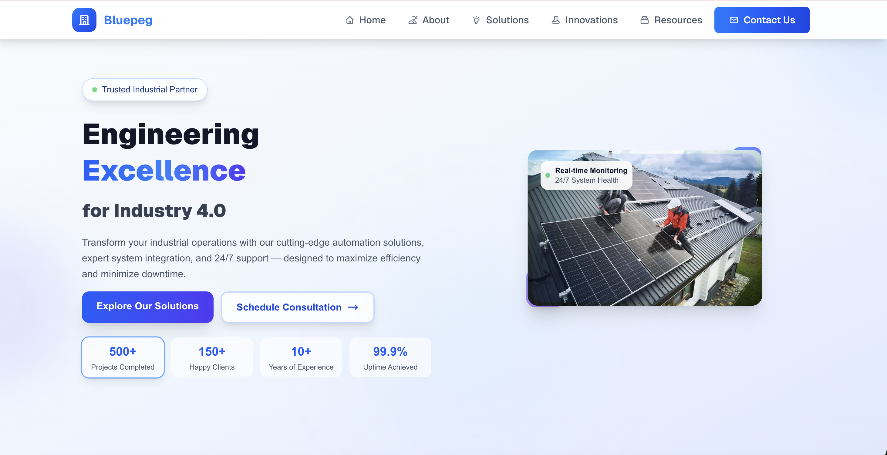

# Bluepeg — The Story of Building an Industrial Operations Platform

## The Journey: How Bluepeg Was Built

Bluepeg began as a vision to revolutionize industrial operations. I wanted to create a digital platform that not only showcased our expertise in automation and engineering, but also told the story of our people, our innovations, and our impact. The journey started with countless brainstorming sessions, wireframes, and a deep dive into the needs of industrial clients. Every feature, every page, and every design choice was made to solve a real problem and deliver value.

### Technologies & Tools: Choices and Reasons

- **Next.js 15**: Chosen for its cutting-edge App Router, static generation, and built-in SEO. Next.js allowed me to build fast, scalable pages and leverage React’s component model for maintainability.
- **TypeScript**: Type safety was non-negotiable. TypeScript helped catch bugs early and made the codebase robust, especially as the project grew.
- **Tailwind CSS**: I wanted rapid prototyping and a unified design system. Tailwind’s utility-first approach made it easy to iterate and maintain consistent styling.
- **React Hooks**: For state management and interactive UI, hooks provided a clean, functional way to handle user interactions and dynamic content.
- **ESLint**: Code quality matters. ESLint kept the codebase clean and enforced best practices, making collaboration easier.

Each tool was selected not just for popularity, but for how it solved specific challenges: speed, scalability, developer experience, and future-proofing.

## Features: What I Built and Why

### 1. **Modern UI/UX**
I wanted users to feel the industrial spirit—clean lines, bold colors, and intuitive navigation. The design is responsive, accessible, and visually engaging, ensuring everyone from engineers to executives can use it effortlessly.

### 2. **Interactive Technology Showcase**
The homepage features technology cards that link directly to Innovation Lab tabs. This smart navigation lets users jump straight to the tech that interests them, improving engagement and reducing friction.

### 3. **Dynamic Tab System**
Deep linking with URL parameters (`?tab=`) means users can share or bookmark specific technology sections. This was added to make the platform more collaborative and user-friendly.

### 4. **Case Studies & Resource Center**
Real client stories and industry guides are front and center. These sections build trust and demonstrate expertise, helping potential clients see our real-world impact.

### 5. **Performance & SEO**
Static generation, optimized images, and Core Web Vitals focus ensure the site loads fast and ranks well. I added meta tags and semantic HTML for discoverability and accessibility.

### 6. **Accessibility**
Industrial clients come from all backgrounds. I made sure the site is WCAG compliant, with semantic HTML and keyboard navigation, so everyone can access our content.

### 7. **Customizable Branding**
From colors in `tailwind.config.js` to fonts in `src/fonts.ts`, everything is easy to update. This flexibility means the platform can evolve with our brand.

## Building the Platform: The Process

1. **Wireframing & Prototyping**: Started with Figma sketches, mapping out user journeys and key interactions.
2. **Component Architecture**: Built reusable React components for everything—hero sections, navigation, team profiles, and more. This made the codebase modular and easy to extend.
3. **Routing & Navigation**: Leveraged Next.js App Router for seamless page transitions and deep linking.
4. **Styling**: Used Tailwind CSS for rapid iteration and consistent design.
5. **Content Integration**: Added real stories, guides, and news to make the site a living resource.
6. **Testing & Optimization**: Used ESLint, TypeScript strict mode, and performance audits to ensure quality.

## Project Structure (at a glance)

```
src/
├── app/                    # Next.js App Router
│   ├── about/             # Our story, mission, vision
│   ├── careers/           # Opportunities & culture
│   ├── case-studies/      # Client success stories
│   ├── contact/           # Get in touch
│   ├── home/              # Homepage
│   ├── innovation-lab/    # R&D and technology showcase
│   ├── news/              # Updates & insights
│   ├── resource-center/   # Guides & documentation
│   ├── solutions/         # Services offered
│   ├── terms/             # Terms & conditions
│   ├── privacy/           # Privacy policy
│   ├── globals.css        # Global styles
│   ├── layout.tsx         # Root layout
│   └── page.tsx           # Homepage
├── components/            # Reusable UI components
│   ├── ClientSuccessSection.tsx
│   ├── CompanyNewsSection.tsx
│   ├── ContactUsSection.tsx
│   ├── Footer.tsx
│   ├── Hero.tsx
│   ├── Navigation.tsx
│   ├── TeamSection.tsx
│   ├── WhatWeDoSection.tsx
│   └── WhoWeAreSection.tsx
└── fonts.ts               # Font configurations
```

## Advantages: Why These Features Matter

- **Speed & Performance**: Fast load times mean happier users and better SEO.
- **Scalability**: Modular architecture makes it easy to add new features or pages.
- **Trust & Transparency**: Case studies and resource guides build credibility.
- **Accessibility**: Everyone can use the platform, regardless of ability.
- **Customization**: Easy to update branding, content, and layout as the company grows.

## Technologies & Tools: Deep Dive

- **Next.js 15**: For SSR, SSG, and API routes. Chosen for its flexibility and performance.
- **TypeScript**: Prevents runtime errors and improves developer productivity.
- **Tailwind CSS**: Rapid styling and a unified design language.
- **React**: Component-based architecture for maintainability.
- **ESLint**: Keeps code clean and consistent.


